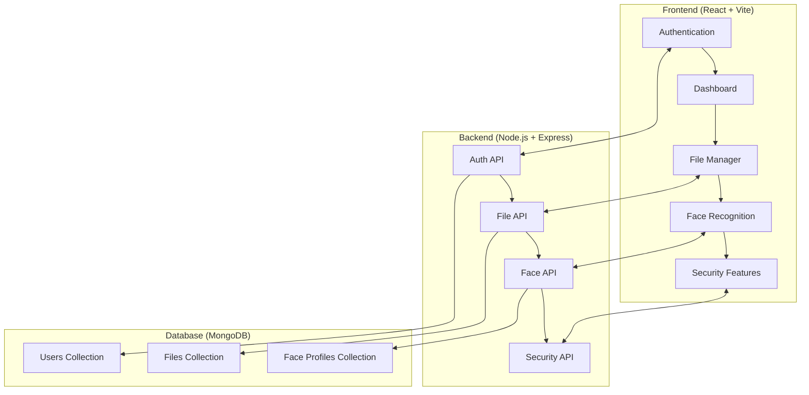

# 🗂️ Secure File Manager

> **Advanced File Management System with Face Recognition, PIN Security, and Modern UI**

A comprehensive React-based file management application featuring biometric authentication, secure folder locking, modern dashboard analytics, and intelligent file processing capabilities.

<div align="center">


</div>

---

## 📸 Screenshots

<div align="center">

### 🏠 Dashboard Overview
<!-- Add your dashboard screenshot here -->

*Modern dashboard with storage analytics and file overview*

### 🔐 Authentication & Security
<table>
  <tr>
    <td align="center">
      <!-- Add login screenshot -->
      <br/>
      <b>🔑 Secure Login</b>
    </td>
    <td align="center">
      <!-- Add face unlock screenshot -->
      <br/>
      <b>👤 Face Recognition</b>
    </td>
  </tr>
</table>

### 📁 File Management
<table>
  <tr>
    <td align="center">
      <!-- Add file browser screenshot -->
      <br/>
      <b>📂 File Browser</b>
    </td>
    <td align="center">
      <!-- Add file upload screenshot -->
      <br/>
      <b>📤 Drag & Drop Upload</b>
    </td>
  </tr>
</table>

### 📱 Responsive Design
<!-- Add mobile view screenshot -->

*Fully responsive design optimized for all devices*

</div>

## 🚀 Live Demo

<div align="center">

**[🌐 Try Live Demo](https://your-demo-link.com)** | **[📱 Mobile Demo](https://your-demo-link.com/mobile)** | **[🎥 Video Tour](https://your-video-link.com)**

> **Demo Credentials:**  
> Email: `demo@filemanager.com`  
> Password: `demo123`

</div>

---

## 🌟 Features

### 🔒 **Advanced Security**
- **Face Recognition** - Biometric authentication using WebRTC and face-api.js
- **PIN Protection** - 4-digit PIN system for folder locking
- **JWT Authentication** - Secure user sessions with token-based auth
- **MongoDB Integration** - Secure storage of user data and face profiles

### 🎨 **Modern UI/UX**
- **Responsive Design** - Optimized for desktop and mobile devices
- **CoreUI Components** - Professional Bootstrap-based component library
- **Framer Motion** - Smooth animations and transitions
- **SweetAlert2** - Beautiful alert dialogs and notifications
- **Lucide Icons** - Modern, consistent iconography

### 📊 **Dashboard & Analytics**
- **Storage Overview** - Visual charts showing storage usage and file types
- **Recent Files** - Quick access to recently accessed files
- **File Type Analysis** - Breakdown of files by type and size
- **Storage Cards** - Quick access to different storage locations

### 📁 **File Management**
- **Drag & Drop Upload** - Easy file uploading with react-dropzone
- **File Organizing** - Create folders, move files, organize structure
- **File Preview** - Quick preview for images, documents, and media
- **Batch Operations** - Select multiple files for bulk operations
- **Search & Filter** - Find files quickly with advanced search

### ⚡ **Performance & Optimization**
- **Web Workers** - Background processing for face detection and file operations
- **Lazy Loading** - Efficient loading of large file lists
- **Caching System** - Smart caching for better performance
- **Error Boundaries** - Graceful error handling and recovery

## 🏠 Architecture Overview

<div align="center">



*Modern microservices architecture with secure API communication*

</div>

## 🎨 Feature Showcase

<div align="center">

| 🔒 Security | 📊 Analytics | 📱 Mobile |
|:---:|:---:|:---:|
| Face Recognition | Storage Charts | Responsive UI |
| PIN Protection | File Analysis | Touch Gestures |
| JWT Auth | Usage Stats | Offline Mode |

</div>

## 🚀 Quick Start

### Prerequisites
- Node.js (v16 or higher)
- npm or yarn
- MongoDB (local or cloud)

### Frontend Setup

```bash
# Clone the repository
git clone https://github.com/Devanghadiyal11/File-Management.git
cd File-Management

# Install dependencies
npm install

# Start development server
npm run dev
```

### Backend Setup

```bash
# Navigate to backend directory
cd backend

# Install backend dependencies
npm install

# Set up environment variables
cp .env.example .env
# Edit .env with your MongoDB URI and JWT secret

# Start backend server
node server.js
```

### Environment Variables

Create a `.env` file in the backend directory:

```env
MONGO_URI=mongodb://localhost:27017/FileManagementSystem
PORT=4000
JWT_SECRET=your_super_secret_jwt_key_here
NODE_ENV=development
```

## 🛠️ Technology Stack

### Frontend
- **React 18.2.0** - Modern React with hooks and suspense
- **Vite 5.0.8** - Lightning-fast build tool and dev server
- **CoreUI React** - Professional Bootstrap components
- **Framer Motion** - Animation library for React
- **SweetAlert2** - Beautiful alert dialogs
- **React Dropzone** - File drag and drop functionality
- **Lucide React** - Beautiful and consistent icons
- **face-api.js** - Face recognition and detection

### Backend
- **Node.js** - JavaScript runtime environment
- **Express.js** - Web application framework
- **MongoDB** - NoSQL database for data storage
- **Mongoose** - MongoDB object modeling
- **JWT** - JSON Web Tokens for authentication
- **bcrypt** - Password hashing and security

### Development Tools
- **ESLint** - Code linting and quality
- **Vite** - Build tool and bundler
- **PostCSS** - CSS processing and optimization
- **Terser** - JavaScript minification

## 📱 Application Screens

### 🏠 Dashboard
- Storage analytics and overview
- Recent files and quick access
- File type breakdown charts
- Storage service cards

### 🔐 Authentication
- Sign in / Sign up forms
- JWT-based session management
- Profile photo upload and management
- Account settings and preferences

### 📂 File Management
- File browser with grid/list views
- Folder creation and organization
- File upload with progress tracking
- Batch file operations

### 🛡️ Security Features
- PIN-protected folders
- Face recognition setup and unlock
- Security settings and preferences
- Access logs and activity tracking

## 🔧 Core Components

### Face Recognition System
- **FaceIdManager** - Core face detection and matching
- **ProfilePhotoModal** - Face registration interface
- **WorkerManager** - Background face processing
- **MongoDB Integration** - Secure face data storage

### Authentication System
- **useAuth Hook** - Authentication state management
- **JWT Integration** - Secure token-based auth
- **Session Management** - Persistent login sessions
- **Profile Management** - User data and preferences

### File Processing
- **Web Workers** - Background file processing
- **Drag & Drop** - Intuitive file upload
- **File Type Detection** - Automatic file categorization
- **Progress Tracking** - Real-time upload progress

## 🎯 API Endpoints

### Authentication
- `POST /api/auth/signin` - User login
- `POST /api/auth/signup` - User registration
- `GET /api/auth/profile` - Get user profile
- `PUT /api/auth/profile` - Update user profile

### Face Recognition
- `GET /api/face-profiles/user/:userId` - Get user faces
- `POST /api/face-profiles` - Create face profile
- `PATCH /api/face-profiles/:faceId/usage` - Update usage stats
- `DELETE /api/face-profiles/:faceId` - Delete face profile
- `GET /api/face-profiles/stats` - Get face statistics

### File Management
- `GET /api/files` - List user files
- `POST /api/files/upload` - Upload files
- `DELETE /api/files/:fileId` - Delete file
- `PUT /api/files/:fileId` - Update file metadata

## 🚀 Performance Optimizations

### Frontend Optimizations
- **Code Splitting** - Lazy loading of routes and components
- **Image Optimization** - Compressed and responsive images
- **Bundle Analysis** - Optimized bundle size and tree shaking
- **Caching Strategy** - Smart caching for API responses

### Backend Optimizations
- **Database Indexing** - Optimized MongoDB queries
- **Connection Pooling** - Efficient database connections
- **Error Handling** - Comprehensive error management
- **Security Headers** - CORS, security headers, and validation

## 🛡️ Security Features

### Data Protection
- **Encryption** - Sensitive data encryption at rest
- **JWT Security** - Secure token implementation
- **Input Validation** - Server-side data validation
- **Rate Limiting** - API rate limiting and abuse prevention

### Privacy
- **Face Data** - Secure biometric data storage
- **User Sessions** - Secure session management
- **Data Isolation** - User data separation
- **Audit Logs** - Activity tracking and logging

## 📚 Documentation

Detailed documentation is available in the project:

- **Face Registration Setup** - `FACE_REGISTRATION_MONGODB_SETUP.md`
- **Face Unlock Implementation** - `FAST_FACE_UNLOCK_COMPLETE.md`
- **Speed Optimizations** - `FACE_UNLOCK_SPEED_FIX.md`
- **Camera Issues** - `CAMERA_ISSUE_FIXED.md`
- **Demo Mode Removal** - `DEMO_MODE_REMOVED.md`
- **Performance Optimizations** - `QUICK_RESPONSE_OPTIMIZATIONS.md`

## 🧪 Testing

### Frontend Testing
```bash
# Run ESLint
npm run lint

# Build for production
npm run build

# Preview production build
npm run preview
```

### Backend Testing
```bash
# Run smoke tests
node smoke_test.js

# Run full test suite
node smoke_full_test.js

# Test face API endpoints
node test-face-api.js
```

## 🔄 Development Workflow

1. **Feature Development**
   - Create feature branch
   - Implement functionality
   - Add tests and documentation
   - Submit pull request

2. **Code Quality**
   - ESLint for code linting
   - Consistent code formatting
   - Component documentation
   - Error handling implementation

3. **Deployment**
   - Build optimization
   - Environment configuration
   - Database migrations
   - Production deployment

## 🌐 Browser Support

- Chrome 88+
- Firefox 85+
- Safari 14+
- Edge 88+

**Note:** Face recognition requires WebRTC support and camera permissions.

## 📊 Project Stats

<div align="center">

<table>
  <tr>
    <td align="center">
      
    </td>
    <td align="center">
      
    </td>
    <td align="center">
      
    </td>
    <td align="center">
      
    </td>
  </tr>
  <tr>
    <td align="center">
      
    </td>
    <td align="center">
      
    </td>
    <td align="center">
      
    </td>
    <td align="center">
      
    </td>
  </tr>
</table>

</div>

## 🤝 Contributing

<div align="center">

**We welcome contributions from the community! 🎆**

</div>

1. Fork the repository
2. Create your feature branch (`git checkout -b feature/AmazingFeature`)
3. Commit your changes (`git commit -m 'Add some AmazingFeature'`)
4. Push to the branch (`git push origin feature/AmazingFeature`)
5. Open a Pull Request

## 📄 License

This project is licensed under the MIT License - see the [LICENSE](LICENSE) file for details.

## 📞 Support

For support, questions, or feature requests:

- Create an issue on GitHub
- Check existing documentation
- Review the troubleshooting guides

## 🎉 Acknowledgments

- **React Team** - For the amazing React framework
- **CoreUI** - For the beautiful component library
- **face-api.js** - For face recognition capabilities
- **MongoDB** - For reliable data storage
- **Vite** - For lightning-fast development experience

---

**Built with ❤️ using React, Node.js, and MongoDB**

*Happy file managing! 🗂️*
